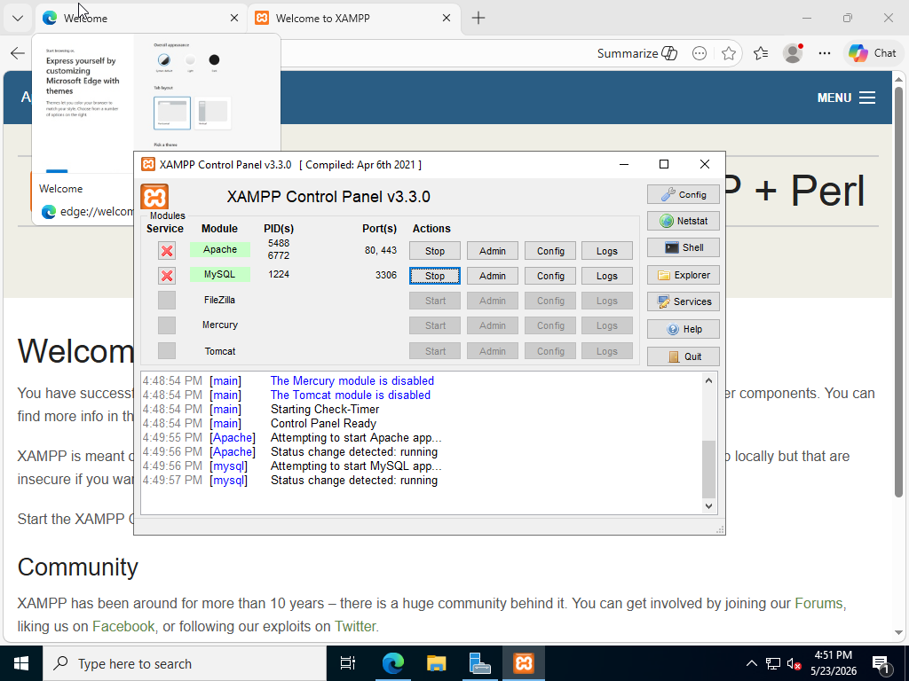
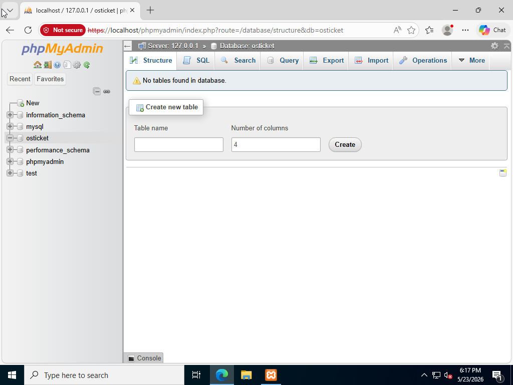

# Project – Help Desk Ticketing System: osTicket via Docker


---

## Overview

This project deploys a **fully functional help desk ticketing system** using osTicket running on a XAMPP web stack (Apache + MySQL) on a local Windows machine. The environment simulates the kind of IT Service Management (ITSM) platform used in real enterprise Help Desk and SOC environments — from installing the web stack and configuring the database, to logging in as an admin, creating tickets as an end user, triaging and claiming them, writing internal notes, and formally closing a ticket with a structured summary.

This lab directly mirrors daily workflows for Help Desk Analysts, SOC Analysts, and Cybersecurity Analysts — and the ticket documentation format practiced here translates directly to enterprise platforms like ServiceNow.

---

## Environment

| Component | Details |
|-----------|---------|
| Web Stack | XAMPP v3.3.0 (Apache + MySQL + PHP) |
| Ticketing Platform | osTicket (Open Source) |
| Database | MySQL — `osticket` database via phpMyAdmin |
| Host Machine | Windows (local machine) |
| Access URL | `http://localhost/osticket/` |
| Admin Panel | `http://localhost/osticket/scp` |
| Admin Credentials | Username: `ostadmin` / Password: `admin1` |

---

## Ticket Workflow Demonstrated

### Ticket Lifecycle Stages Practiced

| Stage | Action |
|-------|--------|
| Submission | End user submits ticket from the support portal |
| Intake | Admin reviews ticket subject, priority, source, and user info |
| Claim | Ticket assigned/claimed by analyst |
| Investigation | Analyst reviews details, requests missing info via Post Reply |
| Internal Notes | SOC-only notes added (not visible to end user) |
| Transfer | Ticket transferred to another team if needed (e.g. Desktop Services) |
| Closure | Ticket resolved with structured Summary / Analysis / Actions / Remediations note |

---

## Build Phases

---

### Phase 3.1 — Install XAMPP (Web Server Stack)

**Actions Taken:**
1. Downloaded XAMPP Windows installer from apachefriends.org
2. Ran installer — selected only **Apache**, **MySQL**, and **PHP**; unchecked FileZilla, Mercury, and Tomcat
3. After installation, opened the **XAMPP Control Panel v3.3.0**
4. Started **Apache** (PIDs 5488, 6772 — ports 80, 443) and **MySQL** (PID 1224 — port 3306)
5. Verified stack by navigating to `http://localhost` in browser — confirmed XAMPP welcome page loaded successfully

**Outcome:** Apache and MySQL running. Control Panel log confirmed: *"Status change detected: running"* for both services. XAMPP welcome page accessible at `http://localhost`.

> **Note on IIS conflict:** If Apache fails to start with a port 80 error, IIS (World Wide Web Publishing Service) is likely occupying the port. Stop and disable it via `services.msc`, then restart Apache in XAMPP.


*XAMPP Control Panel v3.3.0 — Apache running on ports 80 and 443 (PIDs 5488/6772), MySQL running on port 3306 (PID 1224). Control Panel log confirms "Status change detected: running" for both services. XAMPP welcome page confirmed open in browser background (5/23/2026 4:51 PM)*

---

### Phase 3.2 — Install osTicket & Configure Database

**Actions Taken:**

**Database Setup:**
1. Downloaded osTicket Open Source from osticket.com
2. Extracted ZIP — copied `upload` folder contents into `C:\xampp\htdocs\osticket\`
3. In `include\`, renamed `ost-sampleconfig.php` → `ost-config.php`
4. Opened phpMyAdmin via XAMPP Control Panel > MySQL > Admin (`https://localhost/phpmyadmin`)
5. Clicked **New** in the left panel — created database named **`osticket`** — clicked Create

**Outcome:** `osticket` database created and visible in phpMyAdmin alongside system databases (`information_schema`, `mysql`, `performance_schema`, `phpmyadmin`, `test`). No tables yet — ready for osTicket installer to populate.


*phpMyAdmin showing the osticket database created on Server 127.0.0.1 — empty database (no tables yet), ready for osTicket installer. Left panel confirms osticket listed alongside system databases (5/23/2026 6:17 PM)*

**osTicket Installation:**
1. Navigated to `http://localhost/osticket/setup/` — osTicket installer launched
2. Filled in installer fields:
   - Help Desk Name: `IT Support Desk`
   - Admin email, username (`ostadmin`), and password (`admin1`) configured
   - Database Settings: MySQL Database = `osticket`, MySQL Username = `root`, MySQL Password = *(blank — XAMPP default)*
3. Clicked **Install Now** — received Congratulations page confirming successful installation
4. **Post-install security steps:**
   - Deleted `C:\xampp\htdocs\osticket\setup\` folder
   - Set `ost-config.php` to read-only: right-click > Properties > unchecked Modify

---

### Phase 3.3 — Create, Work, and Close a Ticket

**Actions Taken:**

**Ticket Submission (End User Side):**
1. From the admin panel, navigated to the **Support Center** (user-facing portal)
2. Clicked **Open Ticket** — filled in a realistic ticket scenario based on real SOC daily work:
   - **Name:** Gilbert S
   - **Topic:** Report a Problem
   - **Subject:** Release Dark Trace Email
   - **Description:** User reports a quarantined email from an important contact that needs to be released from Dark Trace (AI email security tool used in enterprise environments)
3. Clicked **Create Ticket** — ticket submitted successfully with High priority

**Ticket Triage (Admin/Analyst Side):**
1. Returned to Admin Panel > Tickets > Open Tickets
2. Located the new ticket — confirmed subject, priority (High), user, email, and source displayed
3. Clicked **Claim** — ticket assigned to the logged-in analyst
4. Reviewed ticket details; user had not provided the sender email address
5. Used **Post Reply** to request missing information:
   - Posted: *"What is the sender's email? Please respond in a timely manner to resolve issue."*
   - End user receives an email/Teams/text notification with this reply automatically

**Ticket Closure with Structured Notes:**
1. Changed ticket status to **Resolved**
2. Wrote a formal closure note with the following structure — used in real SOC environments daily:

```
Summary:
User needed email to be released from Dark Trace.
Found email from [sender email]. Below is the reason why it was held.
Email contained a possible phishing attempt.

Analysis:
Reviewed quarantine indicators provided by Dark Trace.
Checked IP against VirusTotal and AbuseIPDB.
Reviewed email content — no malicious activity found.

Actions:
Released ticket to user. Found no malicious activity in the email.
Checked IP and VirusTotal/Abuse. Reviewed content within the email.

Remediations:
Action section detailed all remediations. Closing ticket.
```

3. Clicked **Close** — ticket formally resolved and closed

**Outcome:** Full ticket lifecycle completed — from submission to investigation to structured closure. Ticket #188574 confirmed closed with reply posted successfully.


*osTicket Ticket #188574 — Admin User posted reply to John Doe's account lockout ticket at 11:50 PM: "Hi John, I've located your account and reset your credentials. Please check your email for a temporary password." Reply panel shows From: helpdesk@example.com, Recipients: johndoe@email.com. Post Reply and Post Internal Note tabs visible (5/25/2026)*


*osTicket Staff Panel > Tickets dashboard — success banners confirm "Ticket #188574: Reply posted successfully." Open queue shows Ticket #117180 "osTicket Installed!" from osTicket Team. Admin logged in as Welcome, Admin (5/25/2026)*

---

## Skills Demonstrated

| Skill | How It Was Applied |
|-------|--------------------|
| Web Stack Deployment | Installed and configured XAMPP (Apache + MySQL + PHP) on Windows |
| Database Administration | Created the osticket MySQL database via phpMyAdmin; understood installer-to-database connectivity |
| Application Deployment | Installed osTicket from source, configured PHP settings, completed post-install security hardening |
| ITSM / Help Desk Operations | Worked a live ticket end-to-end — intake, triage, investigation, reply, and closure |
| SOC Ticket Documentation | Wrote structured closure notes (Summary / Analysis / Actions / Remediations) matching real SOC practice |
| Ticket Escalation & Transfer | Demonstrated how to transfer tickets to other teams (e.g. Desktop Services) with context notes |
| Internal Notes vs. User Replies | Used Post Internal Note for analyst-only notes and Post Reply for user-facing communication |
| Security Hardening | Deleted setup directory post-install and set config file to read-only — standard deployment security |

---

## Lessons Learned

**Port conflicts are the most common XAMPP failure.** IIS occupying port 80 silently blocks Apache from starting. Checking `services.msc` before starting XAMPP — and disabling the World Wide Web Publishing Service — prevents this entirely. Knowing to look at port conflicts first is a transferable troubleshooting skill for any web server deployment.

**Ticket documentation quality matters as much as the resolution.** The Summary / Analysis / Actions / Remediations format isn't just good practice — in a real SOC, it's how other analysts, managers, and auditors verify that work was done correctly. A ticket closed with no notes is a liability; a ticket closed with structured notes is evidence.

**Missing information is part of the job.** In the Dark Trace email release scenario, the user didn't provide the sender email — a critical piece of information needed to locate the quarantined message. Knowing when and how to professionally request more information via Post Reply without closing the ticket prematurely is a real Help Desk and SOC skill.

**osTicket mirrors enterprise platforms like ServiceNow.** The core concepts — ticket intake, priority, assignment, internal notes, transfer, and closure — are identical across tools. Building fluency in osTicket transfers directly to ServiceNow, Jira Service Management, Zendesk, and any other ITSM platform an employer uses.

---

## References

- [XAMPP Download — Apache Friends](https://www.apachefriends.org/download.html)
- [osTicket Open Source Download](https://osticket.com/download/)
- [osTicket Documentation](https://docs.osticket.com/)
- [phpMyAdmin Documentation](https://www.phpmyadmin.net/docs/)
- [Gilbert Sanchez — osTicket Lab (YouTube)](https://www.youtube.com/watch?v=K7T_JjvEamg)
